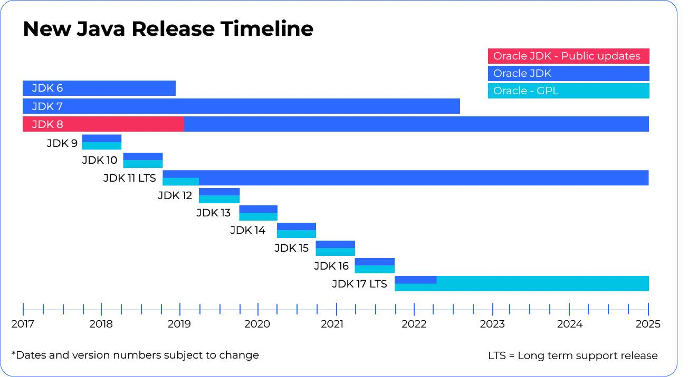

<!-- paginate: false -->
# Neuerungen von 
# Java 9 bis 21

---
<!-- paginate: true -->
## Inhalt
* Release-Zyklus und Long-Term Support-Modell (LTS)
* Syntax-Erweiterungen
    * Private Methoden in Interfaces
    * Diamond-Operator
    * @Deprecated
    * Typinferenz für lokale Variablen ('var')
    * 'switch' Expressions

---
## Inhalt
* Neuerungen im Standard-API
    * Factory-Methoden für Collections und Maps
    * Reactive Streams
    * HTTP-Client API
    * 'Process' API
    * 'Taskbar' API
    * 'StackWalker' API
---
## Inhalt
* Neuerungen in einzelnen Klassen
    * Optional<T>
    * LocalDate, Predicate, Arrays, Objects
    * String
    * Stream<T>
    * CompletableFuture<T>
---
## Inhalt
* Entfernte APIs und Bibliotheken
    * Deprecated APIs und Klassen
    * Werkzeug 'jdeprscan'
* Pattern Matching
    * Einführung in algebraische Datentypen
    * Records und Sealed Classes
    * Einführung in Pattern Matching
    * Mustervergleich mit Type und Guarded Pattern
---
## Inhalt 
* Sonstige Neuerungen im Überblick
    * JVM-Änderungen (Multi-Release-JAR, Garbage Collection u.a.)
    * Weitere Änderungen (Javadoc, Ressource Bundle u.a.)
    * Java-Kommandozeile 'jshell'
    * Direkte Programmausführung ohne Compilerlauf
    * Flight Recorder
    * Microbenchmark Suite
    * Docker-Unterstützung
---

# Release-Zyklus und LTS-Modell

---
## Release-Zyklus und Long Term Support-Modell
+ Java hat seit der Version 9 ein neues Release-Modell eingeführt, das eine klarere Trennung zwischen LTS-Versionen (Long-Term Support) und sogenannten Feature-Releases bietet. 
+ Ziel ist es, Entwicklern mehr Verlässlichkeit und Planungssicherheit zu geben.
---

## LTS-Versionen und Feature-Releases

* LTS-Versionen werden für langfristige Unterstützung angeboten
* Feature-Releases bieten neue Features oder Verbesserungen
* LTS-Versionen erscheinen alle drei Jahre
* Feature-Releases erscheinen alle 6 Monate

---
## LTS-Versionen und Support
* Oracle bietet für LTS-Versionen einen kostenfreien Support-Zeitraum von drei Jahren an. 
* Danach kann man den kommerziellen Oracle-Support in Anspruch nehmen, um weiterhin Aktualisierungen und Unterstützung zu erhalten.


---


*Quelle: https://blankfactor.com/insights/blog/java-17/*

---
# Syntax-Erweiterungen
## Private Methoden in Interfaces

---
## Private Methoden in Interfaces
* Private Interfacemethoden werden innerhalb von Interfaces definiert
* Ermöglichen die Kapselung von gemeinsamen Code zwischen Interface-Methoden
* Nur innerhalb des Interfaces sichtbar
* Seit Java 9 verfügbar
---

## Private Methoden in Interfaces
* Eingeführt in Java 9 (2017)
* Ziel: Code Wiederverwendbarkeit und Vereinfachung von Abstraktion
* Java 8 hatte bereits default Methoden hinzugefügt, aber noch keine "private"
* Java 9 fügte private Methoden hinzu, um Duplizierung in default Methoden zu reduzieren

---
## Private Methoden in Interfaces: Nutzen
* Erhöht Modulare Trennung und Readability
* Reduziert Code-Duplizierung: Teilt Logik zwischen Methoden
* Vereinfacht Abstraktion: Zugriff auf nur vom Interface benötigte Hilfsfunktionen

---
## Beispiel 1: Guards für `default`-Methoden
```java
interface Car {
    default void start(Key key) {
        performChecks(key);
        System.out.println("Car started");
    }

    default void stop(Key key) {
        performChecks(key);
        System.out.println("Car wurst");
    }

    private void performChecks() {
        if (!key.isValid()) {
            throw new IllegalArgumentException("Key not valid!");
        }
    }
}
```

---
## Beispiel 2: Übliche Datentyp-Transformationen

```java
public static final String ANSI_RESET = "\u001B[0m";
public static final String ANSI_RED = "\u001B[31m";

interface DateUtils {

    default String formatTime(LocalDateTime time) {
        return renderDate(time);
    }

    default String formatTimeWithAnsiColor(LocalDateTime time) {
        return ANSI_RED + renderDate(time) + ANSI_RESET;
    }
    
    private String renderDate(LocalDateTime local) {
        DateTimeFormatter formatter = DateTimeFormatter.ofPattern("yyyy-MM-dd HH:mm:ss");
        return local.format(formatter);
    }
}
```
--- 

# Syntax-Erweiterungen
## Optionale Argumente für @Deprecated

---

## Optionale Argumente für `@Deprecated`

* Die `@Deprecated`-Annotation ist schon lange mit dabei
* Neu seit Java 9: Es gibt optionale Argumente
* Mit `since` kann angegeben werden, ab welcher Version die Methode deprecated ist
* Mit `forRemoval` kann zudem angezeigt werden, dass die Methode komplett gelöscht wird

---
## Beispiel: `@Deprecated`-Argumente
```java
public class Worker {
    /**
     * Calculate period between versions
     * @deprecated
     * This method is no longer acceptable to compute time between versions.
     * <p> Use {@link Utils#calculatePeriod(Machine)} instead.
     *
     * @param machine instance
     * @return computed time
     */
    @Deprecated(since = "4.5", forRemoval = true)
    public int calculate(Machine machine) {
        return machine.exportVersions().size() * 10;
    }
}
```